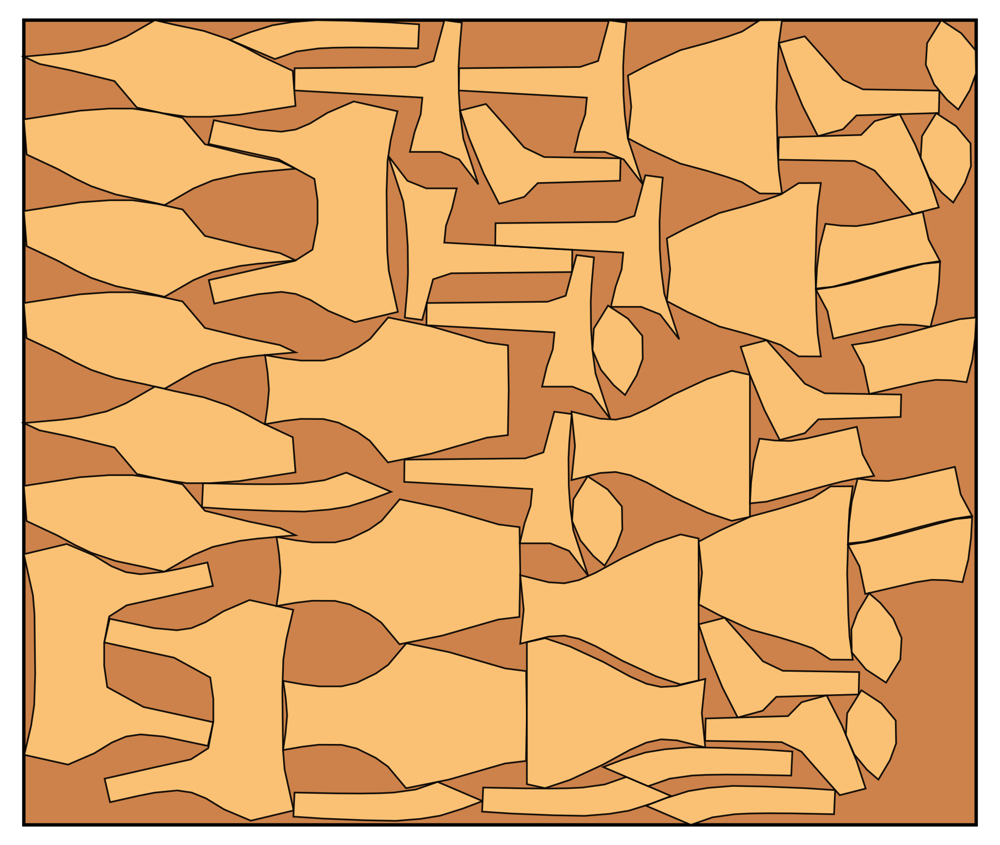
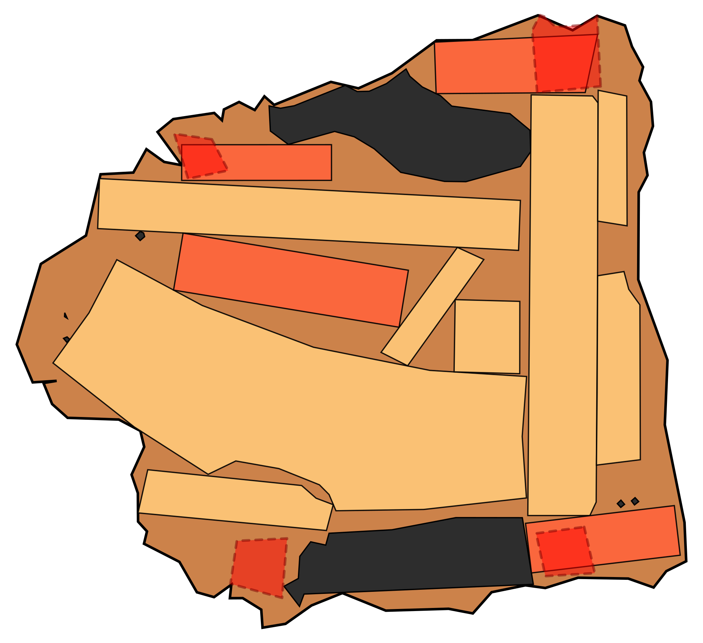
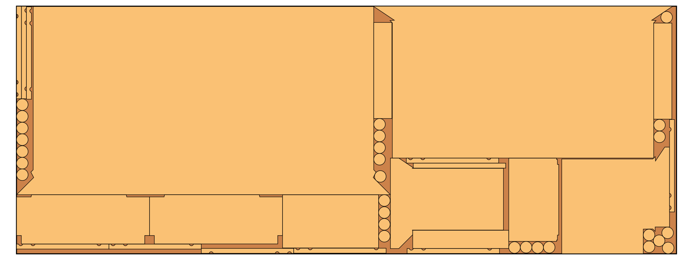

# jagua-rs [](https://github.com/JeroenGar/jagua-rs/actions/workflows/rust.yml) [](https://jeroengar.github.io/jagua-rs/jagua_rs/) [](https://jeroengar.github.io/jagua-rs/benchmarks/) [](https://crates.io/crates/jagua-rs) 

### A fast and fearless collision detection engine for 2D irregular cutting and packing problems.

This library is designed to be used as a backend by optimization algorithms solving 2D irregular cutting and packing problems.


> [!IMPORTANT]
> See [`sparrow`](https://github.com/JeroenGar/sparrow) for a state-of-the-art optimization algorithm based on `jagua-rs`

## Preamble & Motivation

2D irregular cutting and packing (C&P), or nesting, problems are a class of combinatorial optimization problems that involve placing irregular
shaped items into containers in an efficient way.
These problems pose two distinct challenges:

* **Optimization**: searching for the best configuration in which to place the items according to some objective function.
* **Geometric**: ensuring the solution is feasible. Are all items placed entirely in the container? Do none of them collide
  with each other?

Previously, researchers and practitioners tackling nesting problems have had to address both challenges simultaneously, 
requiring two distinct sets of expertise and a lot of research & development effort.

**This project aims to decouple the two challenges by providing an adaptable Collision Detection Engine (CDE) that can efficiently handle the
geometric aspects of 2D irregular C&P problems.**

The CDE's main responsibility is providing a fast and reliable answer to the question: *Can I place this item here without causing any collisions? And if not, which entities would collide with it?*

The CDE embedded in `jagua-rs` is powerful enough to answer millions of these collision queries every second.
It enables you to confidently focus on the combinatorial aspects of the optimization challenge at hand, without
having to worry about the underlying geometry.

In addition, a reference implementation of a basic optimization algorithm built on top of `jagua-rs` is provided in the `lbf` crate.

## `jagua-rs` 🐆

`jagua-rs` includes all components required to create an **easily manipulable internal representation** of 2D
irregular C&P problems and boasts a **powerful Collision Detection Engine (CDE)** to efficiently resolve collision queries.

### Design Goals

- **Performant:**
  - [x] Focused on maximum performance, both in terms of query resolution and update speed
  - [x] Resolves millions of collision queries per second
  - [x] Simplifies polygons using an integrated preprocessor preserving feasibility of the exact original shape.
- **Robust:**
  - [x] Designed to mimic a naive trigonometric approach
  - [x] Special care is taken to avoid numerical instability due to floating-point arithmetic
  - [x] Insensitive to the complexity of the shapes
  - [x] Written in pure Rust 🦀
- **Adaptable:**
  - [x] Define custom C&P problem variants by creating new `Instance`, `Problem` and `Solution` implementations
  - [x] Define additional constraints by creating new `Hazards` and `HazardFilters`
    - [x] `Hazards`: abstraction of all spatial constraints into a single model
    - [x] `HazardFilters`: enables specific `Hazards` to be ignored on a per-query basis
- **Currently supports:**
  - [x] Irregularly shaped items & containers
  - [x] Continuous rotation & translation
  - [x] Holes and inferior quality zones in containers
  - [x] Minimum separation distance between an item and any hazard
  - [x] Modelled problem variants:
    - [x] Bin Packing Problem (with feature `bpp`)
    - [x] Strip Packing Problem (with feature `spp`)
    - [ ] Knapsack Problem (coming soon)


## `lbf` ↙️

The `lbf` crate contains a reference implementation of an optimization algorithm built on top of `jagua-rs`.
It is a simple left-bottom-fill heuristic, which sequentially places the items into the container, each time at the left-bottom
most position.

The code is thoroughly documented and should provide a good starting point for anyone interested in building their own optimization algorithm on top
of `jagua-rs`.

>[!WARNING]
> `lbf` should **not** be used as an optimization algorithm for any real-world use case.
>Read the [Important note](#important-note) section for more information.

### How to run LBF

Ensure [Rust and Cargo](https://www.rust-lang.org/learn/get-started) are installed and up to date.

General usage:

```bash
cd lbf
cargo run --release --bin lbf -- \
  -i <input file> \
  -c <config file (optional)> \
  -s <solution folder> \
  -l <log level (optional)>
```

Concrete example:

```bash
cargo run --release --bin lbf -- \
  -i assets/swim.json \
  -p spp \
  -c assets/config_lbf.json \
  -s solutions
```

### Input

The [assets](assets) folder contains a set of problem instances from the academic literature that were converted to the
same JSON structure.

The files are also available in Oscar Oliveira's
[OR-Datasets repository](https://github.com/Oscar-Oliveira/OR-Datasets/tree/master/Cutting-and-Packing/2D-Irregular).

### Solution

At the end of the optimization, the solution is written to the specified folder.
Two types of files are written:

#### JSON

The solution JSON is similar to the input JSON, but with the addition of the `Solution` key at the top level.
It contains all information required to recreate the solution, such as the containers used, how the items are placed inside and some additional statistics.

#### SVG

A visual representation of every layout of the solution is created as an SVG file.
By default, only the container and the items placed inside it are drawn.
Optionally, the quadtree, hazard proximity grid and fail-fast surrogates can be drawn on top.
A custom color theme can also be defined.

All visual options can be configured in the config file, see [docs](https://jeroengar.github.io/jagua-rs/jagua_rs/io/svg/struct.SvgDrawOptions.html) for all available
options.

Some examples of layout SVGs created by `lbf`:
<p align="center">
  
  
  
</p>

> [!NOTE]  
> Unfortunately, the SVG standard does not support strokes drawn purely inside (or outside) of polygons.
> Items might therefore sometimes falsely appear to be (very slightly) colliding in the SVG visualizations.

### Config JSON

Configuration of `jagua-rs` and the `lbf` heuristic is done through a JSON file.
An example config file is provided [here](assets/config_lbf.json).
If no config file is provided, the default configuration is used.

The configuration file has the following structure:
```javascript
{
  "cde_config": { //Configuration of the collision detection engine
    "quadtree_depth": 5, //Maximum depth of the quadtree is 5
    "cd_threshold": 16, // Perform collision collection immediately if the #edges in a node <= 16
    "item_surrogate_config": {
      "n_pole_limits": [[100, 0.0], [20, 0.75], [10, 0.90]], //See docs for details 
      "n_ff_poles": 2, //Two poles will be used for fail-fast collision detection
      "n_ff_piers": 0 //Zero piers will be used for fail-fast collision detection
    }
  },
  "poly_simpl_tolerance": 0.001, //Polygons will be simplified until at most a 0.1% deviation in area from the original
  "min_item_separation": 0.0, //Minimum distance between items and any hazard
  "prng_seed": 0, //Seed for the pseudo-random number generator. If undefined the outcome will be non-deterministic
  "n_samples": 5000, //5000 placement samples will be queried per item per layout
  "ls_frac": 0.2 //Of those 5000 samples, 80% will be sampled at uniformly at random, 20% will be local search samples
}
```
>[!TIP]
> See [docs](https://jeroengar.github.io/jagua-rs/lbf/config/struct.LBFConfig.html) for a detailed description of all available configuration options.

### Important note

Due to `lbf` being a one-pass constructive heuristic, the final solution quality is very *chaotic*.
Tiny changes in the operation of the algorithm (sorting of the items, configuration, prng seed...)
will lead to solutions with drastically different quality. \
Seemingly superior configurations (such as increased `n_samples`), for example, may result in worse solutions and vice versa. \
Omitting `prng_seed` in the config file disables the deterministic behavior and will demonstrate this variation in solution quality.

**This heuristic merely serves as a reference implementation of how to use `jagua-rs` 
and should  not be used as an optimization algorithm for any real-world use case.**

For a state-of-the-art optimization algorithm built on top of `jagua-rs` see [`sparrow`](https://github.com/JeroenGar/sparrow) instead.

## Continuous Integration

The `jagua-rs` codebase contains a suite of assertion checks which verify the correctness of the engine.
These `debug_asserts` are enabled by default in debug and test builds, but are omitted in release builds to maximize performance.

On every commit and pull request, the following GitHub Actions workflows are run:
  - Full compile and format check.
  - Integration tests to simulate an optimization run on a range of instances/configurations with all checks enabled.
  - Performance benchmarks to alert in case of regressions (see historical [Performance Tracker](https://jeroengar.github.io/jagua-rs/benchmarks/)).
  - Documentation generation and deployment (see [Documentation](#documentation) section below).

Tests and benchmarks can be run locally with `cargo test` and `cargo bench --bench ci_bench` respectively.

The coverage and granularity of the tests need to be expanded in the future.

## Documentation

This library is thoroughly documented with rustdoc.
The most recent version is automatically deployed and hosted at:

- `jagua-rs` docs: [https://jeroengar.github.io/jagua-rs/jagua_rs/](https://jeroengar.github.io/jagua-rs/jagua_rs/)
- `lbf` docs: [https://jeroengar.github.io/jagua-rs/lbf/](https://jeroengar.github.io/jagua-rs/lbf/)

Alternatively, you can build the docs locally: `cargo doc --open`.

## Development

Contributions to `jagua-rs` are more than welcome!
To submit code contributions: [fork](https://help.github.com/articles/fork-a-repo/) the repository,
commit your changes, and [submit a pull request](https://help.github.com/articles/creating-a-pull-request-from-a-fork/).

## License

This project is licensed under Mozilla Public License 2.0 - see the [LICENSE](LICENSE) file for details.

## Acknowledgements

This project began development at the CODeS research group of [NUMA - KU Leuven](https://numa.cs.kuleuven.be/) and was funded by [Research Foundation - Flanders (FWO)](https://www.fwo.be/en/) (grant number: 1S71222N).
<p>

&nbsp;

</p>
